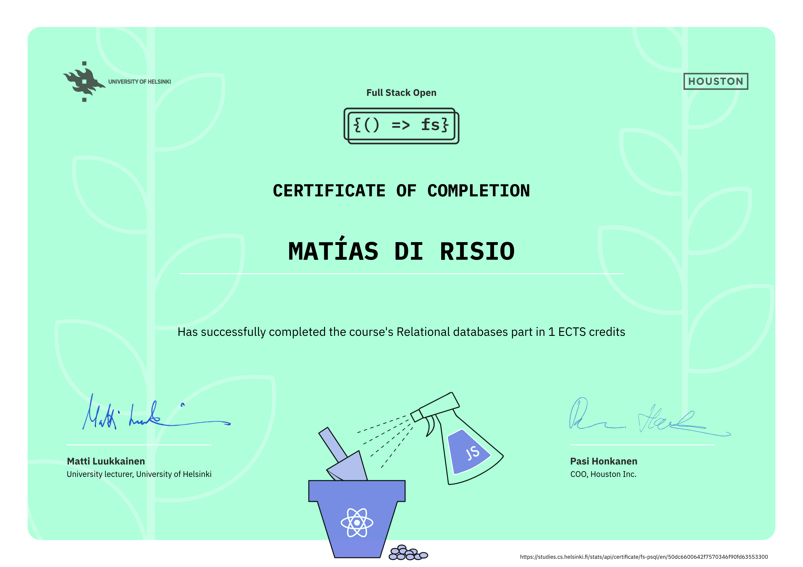

# Full Stack Open - Parte 13 🧐

> [!NOTE]  
> Los enunciados de todos los ejercicios de esta parte se encuentran en el siguiente link:  
> [Enunciados Parte 13](https://github.com/DiriARG/full-stack-open/blob/main/parte-13/README.md)  
> Link de mi repositorio principal del curso Full Stack Open:  
> [Repositorio principal](https://github.com/DiriARG/full-stack-open)

En este repositorio encontrarás mis respuestas a los ejercicios correspondientes a la [Parte 13](https://fullstackopen.com/es/part3) del curso [Full Stack Open](https://fullstackopen.com/es/), dictado por la [Universidad de Helsinki](https://www.helsinki.fi/en) en colaboración con [Houston Inc](https://www.houston-inc.com/).

### Importante

Las respuestas a los ejercicios de la Parte 13 se encuentran en este repositorio independiente, porque se sigue la recomendación que aparece en el primer ejercicio (13.1).  
Dicha recomendación dice:

```plaintext
"Cree un repositorio de GitHub para la aplicación" ...
```

## Desarrollador 👨‍💻:

- **Desarrollador:** Matías Di Risio 👍
- **GitHub:** [DiriARG](https://github.com/DiriARG)

## Despliegue en Línea 🚀

> [!NOTE]  
> El despliegue de esta aplicación fue realizado en **Render** y no en **Heroku** ni **Fly.io**, ya que actualmente estas plataformas no cuentan con un plan gratuito disponible, mientras que Render sí lo ofrece.
>
> Además, la **Parte 3 del curso** también fue desplegada utilizando **Render**, por lo que decidí mantener la misma plataforma a lo largo del curso.

El backend de la aplicación ya se encuentra desplegado y accesible en línea a través del siguiente enlace: 👉
[Ver aplicación en Render](https://full-stack-open-parte-13.onrender.com).

## Certificado del curso 😁:


